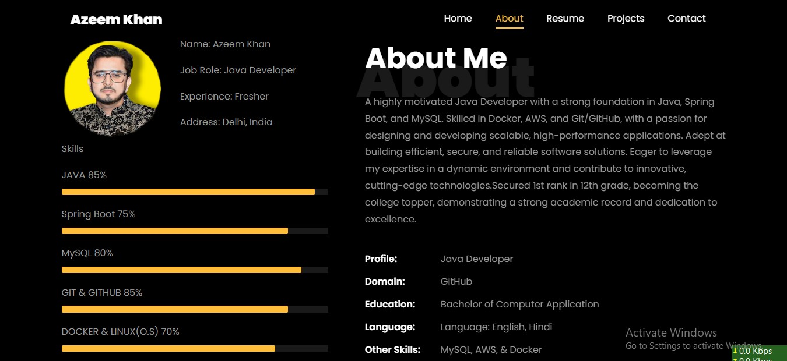

Azeem Khan Portfolio Website

This is my personal portfolio website showcasing my skills, projects, and contact information. Built using HTML, CSS,JavaScript, and designed for responsiveness.

Technologies Used:
HTML5
CSS3 / SCSS
JavaScript
VS Code

Features:
Responsive and modern design
Clean and structured code
Easy to customize and update

How to Run Locally
Clone the repo:
Copy this link: git clone https://github.com/Azeemkhan315/Azeem-Portfolio-Web.git
Open the project in VS Code.
Open index.html in your browser.

Contact Me
Feel free to connect with me:
LinkedIn: https://www.linkedin.com/in/Azeemkhan3780
Email: azeemkhan37804@gmail.com

Portfolio Website
License
This project is open-source and free to use.
Preview: 

